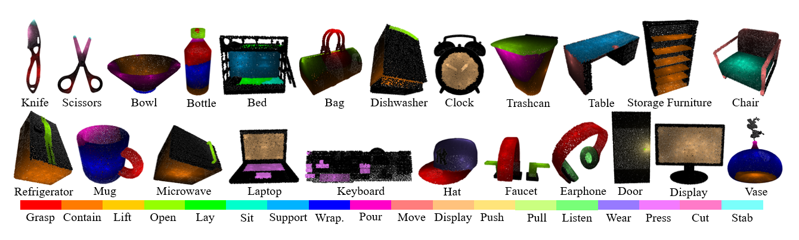

# 3D AffordanceNet

This repository is the official experiment implementation of 3D AffordanceNet benchmark.

3D AffordanceNet is a 3D point cloud benchmark consisting of 23k shapes from 23 semantic object categories, annotated with 56k affordance annotations and covering 18 visual affordance categories.

This repository implements two baseline methods: PointNet++ and DGCNN on four proposed affordance understanding tasks: Full-Shape, Partial-View, Rotation-Invariant, Semi-Supervised Affordance Estimation.

You can reproduce the performances described in the origin paper by simply running a command down below.

[[CVPR 2021 Paper]](https://arxiv.org/abs/2103.16397) [[Dataset Download Link]](https://drive.google.com/drive/folders/1s5W0Nfz9NEN8gP14tge8GuouUDXs2Ssq?usp=sharing) [[Project Page]](https://andlollipopde.github.io/3D-AffordanceNet/#/)



## Requirements

All the codes are tested in the following environment:

* Linux (tested on Ubuntu 16.04)
* Python 3.7+
* PyTorch 1.0.1
* Gorilla-Core
* CUDA 10.0 or higher

You can install the required packages by running the following command:
```
pip install -r requirements.txt
```

To install the cuda kernel, go to [models/pointnet2_ops](models/pointnet2_ops) and run the following command:
```
python setup.py build_ext --inplace
```

## Quick Start

The following set up is for DGCNN, you can change to PointNet++ accordingly.

First download the whole dataset from [here](https://drive.google.com/drive/folders/1s5W0Nfz9NEN8gP14tge8GuouUDXs2Ssq?usp=sharing) and extract the files to the `data_root`, then modify the dataset `data_root` in [configuration(full-shape for example)](config/dgcnn/estimation_cfg.py), the dataset `data_root` should obey the data structure below: 

```
data_root
    ├── task_train_data.pkl
    ├── task_val_data.pkl
    └── task_test_data.pkl
```

Then to train a model from scratch:

```
python train.py config/dgcnn/estimation_cfg.py --work_dir TPATH_TO_LOG_DIR --gpu 0,1
```

After training, to test a model:

```
python test.py config/dgcnn/estimation_cfg.py --work_dir PATH_TO_LOG_DIR --gpu 0,1 --checkpoint PATH_TO_CHECKPOINT
```

## Currently Support

* Models
    - [x] DGCNN
    - [x] PointNet++
* Tasks
    - [x] Full-Shape Affordance Estimation
    - [x] Partial-View Affordance Estimation
    - [x] Rotation-Invariant Affordance Estimation
    - [x] Semi-Supervised Affordance Estimation

## Cite Us
```
@inproceedings{deng20213d,
  title={3D AffordanceNet: A Benchmark for Visual Object Affordance Understanding},
  author={Deng, Shengheng and Xu, Xun and Wu, Chaozheng and Chen, Ke and Jia, Kui},
  booktitle={Proceedings of the IEEE Conference on Computer Vision and Pattern Recognition},
  year={2021}
}
```
